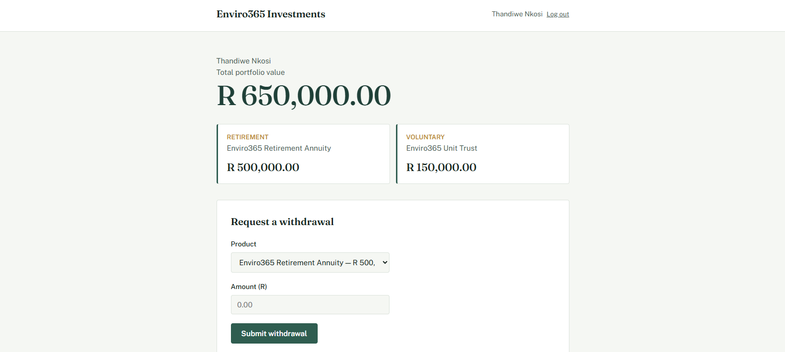

# Enviro365 Investments — Withdrawal Notice System

Full-stack technical assessment (Junior Developer) for eTalente / Enviro365 Investments.

Investors log in, view their portfolio, submit withdrawal notices, view
withdrawal history, and export CSV statements — all backed by server-side
business-rule validation.

## Screenshots

**Login**


**Portfolio dashboard**



## Tech stack

- **Backend:** Java 17, Spring Boot 3.3, Spring Data JPA, H2 (in-memory)
- **Frontend:** React (Vite)
- **Testing:** JUnit 5, Mockito, AssertJ

> The frontend was originally built in plain HTML/JS, then rebuilt in React
> partway through development — see the `revert/html-js-frontend` PR in the
> commit history for that change.

## Repository structure

```
backend/    Spring Boot REST API
frontend/   React (Vite) UI
docs/       README assets (screenshots)
```

## Business rules implemented

1. Retirement withdrawals are only allowed if the investor's age is over 65
2. A withdrawal must not exceed the product's current balance
3. A withdrawal must not exceed 90% of the product's current balance

All three are enforced in `WithdrawalService` on the backend (never trust
the client) and mirrored on the frontend for instant feedback.

## Advanced requirements implemented (3 of 5)

- **Unit tests** — `WithdrawalServiceTest`, `CsvExportServiceTest`,
  `PortfolioServiceTest`, `AuthServiceTest`, `InvestorTest`,
  `WithdrawalRequestTest` (24 tests total, all passing)
- **Input validation** — `@Valid` request DTOs on the backend
  (`WithdrawalRequest`, `RegisterRequest`, `LoginRequest`)
- **UI validation** — client-side checks in the React withdrawal form that
  mirror the backend's rules, for instant feedback without a round trip

## Beyond the brief

- **Login / registration** — simple, email-only "who am I" flow (no
  password) so the app can be demoed as a specific investor, or a new one
  can be registered on the fly. This is *not* real authentication — no
  sessions, tokens, or password hashing — since auth isn't part of the
  assessment's requirements. See `AuthService`'s Javadoc for the reasoning.
- **Two seeded investors** on opposite sides of the retirement-age rule
  (one over 65, one under), so both branches of that business rule can be
  exercised immediately without manually editing data.

## Setup

### Backend

Requires Java 17+ and Maven (or an IDE like IntelliJ, which bundles Maven).

```bash
cd backend
mvn spring-boot:run
```

Runs on http://localhost:8080. H2 is in-memory and reseeds sample data on
every startup (see `DataSeeder`).

**H2 console** (to inspect the database directly): with the backend
running, visit http://localhost:8080/h2-console and connect with:
- JDBC URL: `jdbc:h2:mem:enviro365db;DB_CLOSE_DELAY=-1`
- User: `sa`, no password

### Frontend

Requires Node.js.

```bash
cd frontend
npm install
npm run dev
```

Runs on http://localhost:5173 by default. Make sure the backend is running
first.

### Running the tests

In IntelliJ: right-click `backend/src/test/java` → Run All Tests.
From the command line: `cd backend && mvn test`.

## API overview

| Method | Endpoint | Description |
|--------|----------|--------------|
| POST   | `/api/auth/login`                        | Log in by email (no password) |
| POST   | `/api/auth/register`                     | Register a new investor (creates an empty portfolio) |
| GET    | `/api/investors`                         | List investors |
| GET    | `/api/investors/{id}`                    | Investor detail |
| GET    | `/api/investors/{id}/portfolio`          | Portfolio + products |
| POST   | `/api/investors/{id}/withdrawals`        | Create a withdrawal notice |
| GET    | `/api/investors/{id}/withdrawals`        | Withdrawal history |
| GET    | `/api/investors/{id}/withdrawals/export` | CSV export (optional `status`, `from`, `to` filters) |

Errors return a consistent JSON body:
```json
{
  "timestamp": "2026-09-11T09:00:00",
  "status": 400,
  "error": "Business Rule Violation",
  "message": "Withdrawal amount (480000) exceeds the maximum allowed withdrawal of 90% of balance (450000.00)."
}
```

## AI usage disclosure

This solution was built with AI assistance (Claude, via Anthropic's
Claude.ai). AI was used to scaffold the Spring Boot project structure,
implement the JPA entities/repositories/services/controllers, write the
business-rule validation logic, build the React frontend components, write
the unit test suite, and design the visual styling. All AI-assisted code
was reviewed and is understood; code comments throughout explain the
reasoning behind key design decisions (e.g. why withdrawals are tied to a
`Product` rather than the whole `Portfolio`, why the exception handling is
scoped narrowly rather than fully "global", why login/registration is
deliberately not real authentication). Ready to walk through any part of
it in the follow-up interview.
